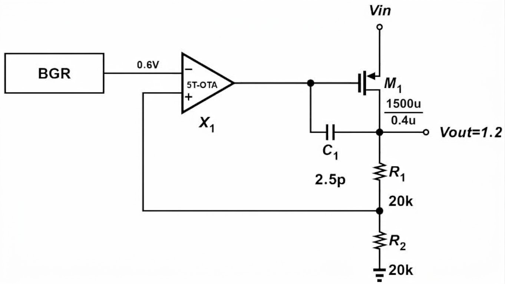
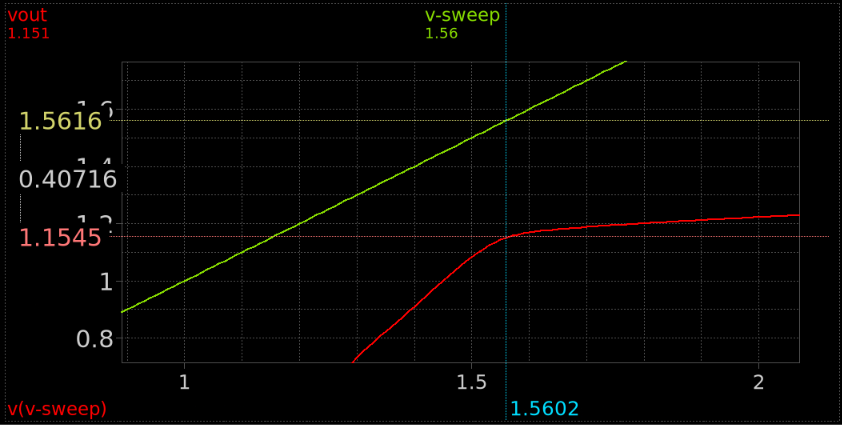
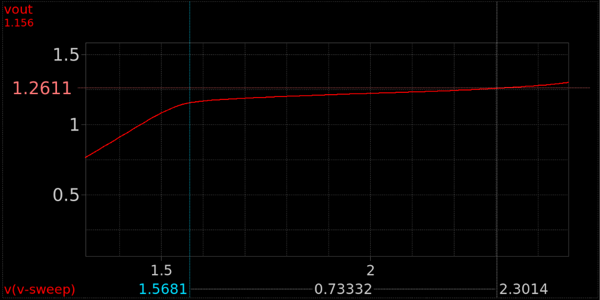
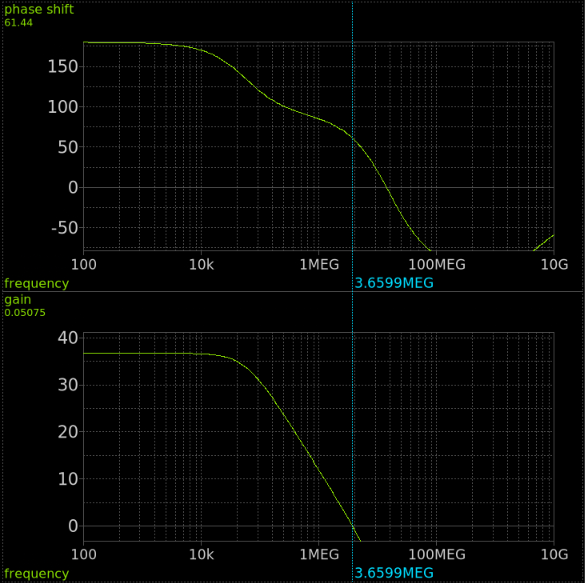
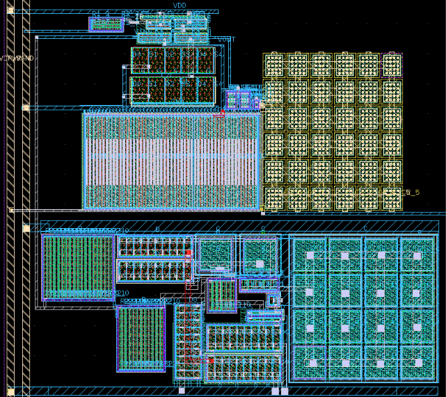
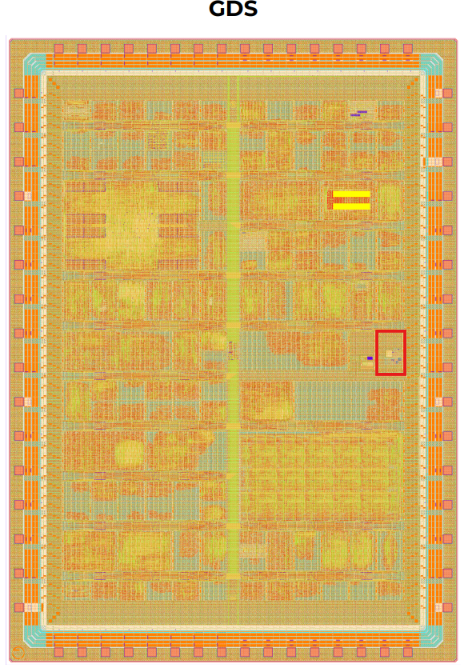

# Capless LDO Regulator (1.2 V, 10 mA) – Tiny Tapeout IHP 26b

## 1. Overview

This is a capless low-dropout (LDO) regulator that provides a regulated **1.2 V** output at up to **10 mA** from a supply of roughly 1.56–2.3 V. It was designed as a learning project and submitted to the **Tiny Tapeout IHP 26b** shuttle.

**Project context**

- This is my first LDO design. The goal was to learn how a capless LDO works, so there were no fixed target specifications. The numbers below are the results I achieved, not targets I tuned to.
- The whole design, including layout, was completed in 9 days to meet the Tiny Tapeout deadline.
- The layout was drawn by hand. I used transistor fingers and multipliers to get a reasonable area and matching, but no advanced matching techniques.
- The 10 mA maximum load is limited by the Tiny Tapeout specs.

## 2. Architecture

| Block | Description |
|---|---|
| Reference (BGR) | Bandgap reference, 0.6 V |
| Error amplifier (X1) | 5-transistor OTA, reference on the inverting input, feedback on the non-inverting input |
| Pass device (M1) | PMOS, W/L = 30 µ / 0.4 µ |
| Compensation (C1) | 2.5 pF Miller capacitor between the OTA output (M1 gate) and Vout |
| Feedback divider | R1 = R2 = 20 kΩ |

The output voltage is set by the divider and the reference:

Vout = Vref × (1 + R1/R2) = 0.6 V × (1 + 20k/20k) = **1.2 V**

The design has no external output capacitor. Stability relies on the internal Miller capacitor C1 and the small on-chip load (0–20 pF).

## 3. Specifications and results

| Parameter | Value | Notes |
|---|---|---|
| Output voltage | 1.2 V | Set by BGR and divider |
| Input voltage range | 1.56 – 2.3 V | Simulated sweep range |
| Maximum load current | 10 mA | Limited by Tiny Tapeout specs |
| Dropout voltage | ≈ 0.4 V (0.407 V) | At Vin = 1.56 V, where Vout = 1.154 V (see section 4.1) |
| Line regulation | 143 mV/V | From the Vout vs Vin sweep (section 4.2) |
| Quiescent current | 65 µA | BGR 15 µA + OTA 20 µA + feedback divider (remainder) |
| Current efficiency at 10 mA | ≈ 99.3 % | 10 mA / (10 mA + 65 µA) |
| Load capacitance | 0 – 20 pF | About 5 pF of parasitic capacitance already comes from the signal path in the Tiny Tapeout chip |
| DC loop gain | ≈ 36.5 dB | Section 4.3 |
| Unity-gain frequency | ≈ 3.66 MHz | Section 4.3 |
| Phase margin | ≈ 61° | Section 4.3 |

## 4. Simulation results

### 4.1 Dropout

Vin was swept upward while monitoring Vout. At the lower end of the sweep (Vin ≈ 1.56 V) Vout is 1.154 V, giving Vin − Vout ≈ 0.407 V. Below this point Vout falls steeply as the pass device runs out of headroom. Note that Vout is already about 4 % below the 1.2 V nominal at this point.

### 4.2 Line regulation

Across the 1.56 V to 2.3 V input range, Vout rises from about 1.15 V to about 1.26 V. The slope corresponds to a line regulation of **143 mV/V**. Because of this slope, Vout equals 1.2 V only around the middle of the input range, and it varies by roughly −4 % to +5 % across the full range.

### 4.3 Loop gain and stability

- DC loop gain: about 36.5 dB
- Unity-gain frequency: 3.66 MHz (gain ≈ 0 dB at the cursor)
- Phase margin: about 61° (61.44° at the crossover)

The loop is stable with a comfortable margin at the simulated condition.

## 5. Layout

The layout was drawn manually for the Tiny Tapeout IHP 26b shuttle. The large striped block is the pass device M1, and the large square arrays are the capacitors. Fingers and multipliers were used to reach a compact area and reasonable matching. Advanced techniques such as common-centroid placement and dummy devices were not used because of the 9-day schedule.

## 6. Tiny Tapeout integration

The LDO is placed on the Tiny Tapeout IHP 26b chip. Its location in the full-chip GDS is marked by the red box.

## 7. Limitations and future work

- Line regulation (143 mV/V) is weak. The main causes are likely the modest loop gain (≈ 36.5 dB) and the short channel of M1 (L = 0.4 µm). Higher OTA gain and a longer pass-device channel would help.
- Vout varies by several percent across the input range, so the dropout point depends on how it is defined.
- Not yet characterized: load regulation, PSRR, load and line transient response, output noise, and corner/temperature variation.
- Layout matching can be improved with common-centroid placement, dummy devices and better guard rings.
- Silicon measurements are not yet available.
